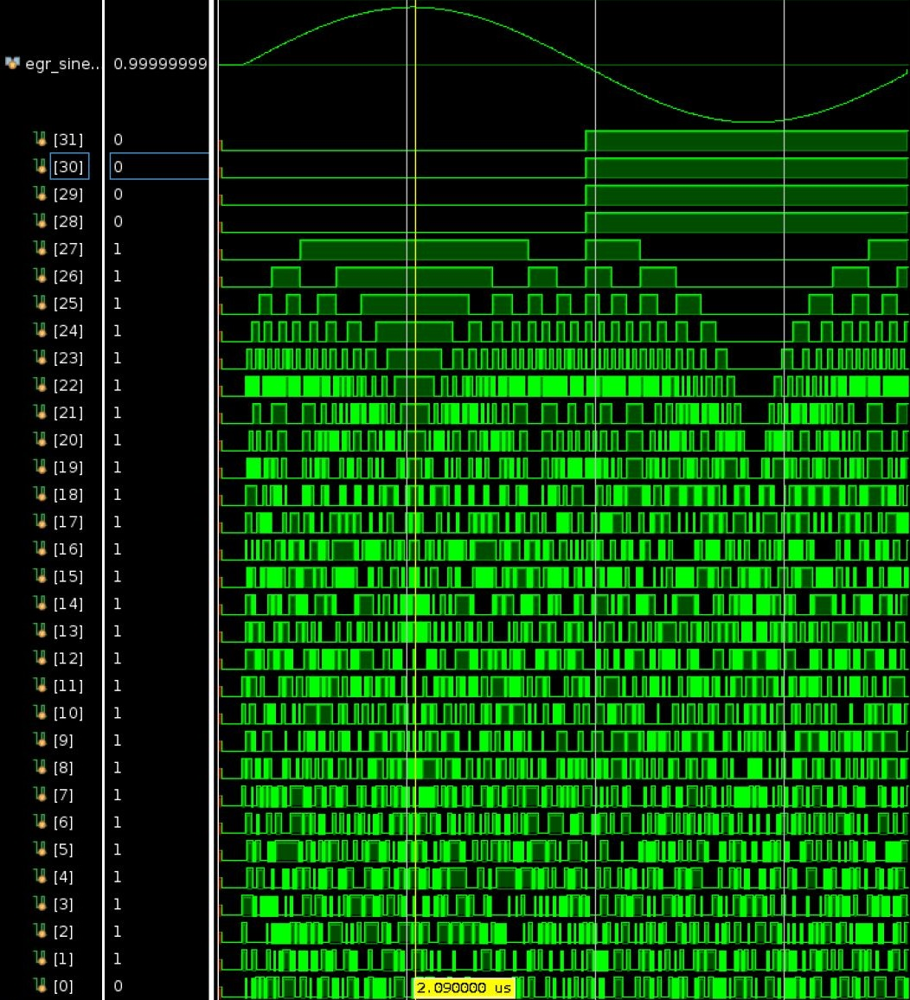
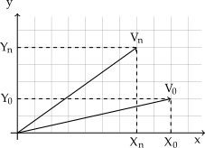

# CORDIC - System Verilog


This is a System Verilog implementation of the CORDIC algorithm. The design use fixed point representation of the input and output vectors. The input should be between ±2π with four integer bits and the rest as fractional bits and the output will be between ±1.

## Repository layout

- [`rtl/`](rtl) — the synthesizable design. It depends on no other core;
  `cordic_axi4s_if` is the top level.
- [`sv/`](sv) — the UVM testbench (`akerlund::cordic_example:0`). Needs VCS
  and UVM-1.2.
- [`py/`](py) — the cocotb/pyUVM port (`akerlund::cordic_example_py:0`). Runs
  on Verilator, and checks every beat against Python's `math.cos`/`math.sin`.
- [`scripts/python/`](scripts/python) — offline generators for the atan and
  angle tables. Not part of any build.
- [`submodules/`](submodules) —
  [`vip_axi4s_agent`](https://github.com/akerlund/vip_axi4s_agent) (which
  carries [`vip_clk_rst_agent`](https://github.com/akerlund/vip_clk_rst_agent),
  [`vip_gauss`](https://github.com/akerlund/vip_gauss) and
  [`vip_report_server`](https://github.com/akerlund/vip_report_server) of its
  own) and [`vip_common`](https://github.com/akerlund/vip_common) (fixed-point
  helpers, used by the Python testbench and the table generators).

```
git clone --recurse-submodules git@github.com:akerlund/rtl_cordic.git
```

## Building

```
fusesoc run --target=rtl akerlund::cordic         # Verilator lint, no dependencies
./py/run_fusesoc.sh                               # cocotb regression (Verilator)
fusesoc run --target=uvm akerlund::cordic_example # UVM testbench (VCS + UVM-1.2)
```

`run_fusesoc.sh` sets `PYTHONPATH` for the agent and `vip_common` before
handing over to FuseSoC; run it rather than invoking the `sim` target directly.

## Number format

Every vector is N4Q28: four integer bits, the first of them the sign, and 28
fractional bits. Input theta spans ±2π, which fits because 2π < 2³; the sine
and cosine outputs span ±1. `cordic_radian_core` takes the absolute value of
theta before folding it into a quadrant, so a negative input returns
cos(|θ|) and sin(|θ|), not the signed sine.

With 16 stages the worst observed error across a full 360-step turn is
5.4e-05 on either output.

This implementation of the CORDIC algorithm can yield a simulation like this



## Feature

 - Fixed point representation
   - Output span is ±1
   - Input span is ±2π, other values are invalid
   - Using 4 integer bits
     - One for sign
     - Three decimal bits because: max(abs(input)) ≤ 2π < (2^3 - 1)
     - All other bits become fractional bits
 - Parameters
   - Number of stages, maximum 32
   - Data width, maximum 64
 - AXI4-S interface
   - Shift register to signal a requesting master back the following:
     - tvalid
     - tid
     - tdata, ingress tuser to select either sine or cosine

## Synthesis

Out-of-context synthesis for the Zynq-7020 (`xc7z020clg484-1`), reproducible
from this repository:

```sh
./scripts/run_synth_vivado.sh
```

Out of context because `cordic_axi4s_if` is an IP block, not a device design:
it skips I/O buffer insertion and pin mapping, so the numbers describe the core
logic rather than an artificial pinout. It also means a bitstream is neither
wanted nor possible, which is why the script stops after synthesis rather than
using the flow's default target.

At the core's default parameters — `AXI_DATA_WIDTH_P=16`, `AXI_ID_WIDTH_P=4`,
`NR_OF_STAGES_P=16` — Vivado 2025.2 reports:

```text
+----------------------------+------+-------+------------+-----------+-------+
|          Site Type         | Used | Fixed | Prohibited | Available | Util% |
+----------------------------+------+-------+------------+-----------+-------+
| Slice LUTs*                |  797 |     0 |          0 |     53200 |  1.50 |
|   LUT as Logic             |  792 |     0 |          0 |     53200 |  1.49 |
|   LUT as Memory            |    5 |     0 |          0 |     17400 |  0.03 |
|     LUT as Shift Register  |    5 |     0 |            |           |       |
| Slice Registers            |  704 |     0 |          0 |    106400 |  0.66 |
|   Register as Flip Flop    |  704 |     0 |          0 |    106400 |  0.66 |
|   Register as Latch        |    0 |     0 |          0 |    106400 |  0.00 |
+----------------------------+------+-------+------------+-----------+-------+
```

No DSP slices: every stage is a shift and an add, which is the point of CORDIC.
No latches, and no bonded IOBs — the latter expected, since out-of-context
synthesis maps no pins.

Cost scales with `NR_OF_STAGES_P`, since the stages are a pipeline: more stages
buy more accuracy at a proportional cost in LUTs and registers.

Yosys maps the same configuration to 3943 standard cells (40814 µm²) on
sky130hd:

```sh
refuse yosys --target rtl
```

## CORDIC Theory

The CORDIC (COordinate Rotation Digital Computer) algorithm was developed by Jack Volder in 1959[1, 2] to calculate trigonometric functions, i.e., sine and cosine. Its advantage when implemented in hardware is that, as an iterative algorithm, it only uses shift, add and subtract operations to convert between polar and Cartesian coordinates. In circular rotation mode the Cartesian coordinates of a desired vector can be found by rotating another vector around it and iterate towards the correct coordinates. The range of rotation differs from stage to stage and is described as

*(Eq. 1)*

$$
\tan(\Theta) = \pm 2^{-i}, \; i \geq 0
$$

where *i* denotes the stage number. The idea is that the values from the above equation are saved in a look-up table (LUT) and are used as the angles for rotating the input vector around the desired vector. Every rotation around or towards the desired angle will increase the accuracy of the approximation of the desired angle's vector as it will get closer every iteration.



*Figure 1. Simplified example of an input vector used to approximate another.*

Recall that any vector like $V_n = [X_n, Y_n]$, illustrated in Fig. 1, can be described as in

*(Eq. 2)*

$$
X_n = X_0 \cdot \cos(\Theta) - Y_0 \cdot \sin(\Theta) = \cos(\Theta)\left[X_0 - Y_0 \cdot \tan(\Theta)\right]
$$

and

*(Eq. 3)*

$$
Y_n = Y_0 \cdot \cos(\Theta) + X_0 \cdot \sin(\Theta) = \cos(\Theta)\left[Y_0 + X_0 \cdot \tan(\Theta)\right]
$$

These equations include some trigonometric operations which will be reduced step by step. The *sin* term can be removed by dividing the expression with *cos* which in turn yields a new expression with only *cos* and *tan* terms. The first step towards further simplification is to consider if the tangent function is restricted as in (1), which essentially describes a shift operation. Deriving the first values from this method yields:

$$
\tan(\Theta) = \pm\, 2^{0},\, 2^{-1},\, 2^{-2},\, 2^{-3},\, \dots,\, 2^{-i} = \pm\, 1,\, \frac{1}{2},\, \frac{1}{4},\, \frac{1}{8},\, \dots,\, \frac{1}{i}
$$

Further calculations for the respective angles of the function are shown in Table 1.

The desired angle can be found by iterative rotations of the input vector with the angles in Table 1. An infinite amount of rotations would allow the result to converge at the exact angle.

| *i* | $atan(2^{-i})$     | Θ        |
| -   | :-             |       -: |
| 0   | atan(1)        | 45       |
| 1   | atan(1/2)      | 26.565   |
| 2   | atan(1/4)      | 14.036   |
| 3   | atan(1/8)      | 7.125    |
| 4   | atan(1/16)     | 3.576    |
| 5   | atan(1/32)     | 1.789    |
| 6   | atan(1/64)     | 0.895    |
| 7   | atan(1/128)    | 0.448    |
| 8   | atan(1/256)    | 0.224    |
| 9   | atan(1/512)    | 0.112    |

*Table 1. Possible angles of*  $atan(2^{-i})$.

An example of rotation is shown in Table 2. The desired angle in Table 2 is 20°, and this angle will be set as the input vector for the first stage. At the first iteration the angle's sign is compared, and if positive, it would then be subtracted by the respective value in the tangent look-up table. Then, in the following iteration the input vector is now -25° and will again be compared. This time it is negative, so the respective look-up table value will be added to it and be equal to 1.565°. The pattern should now be clear; at each iteration it is decided in which direction to rotate. Table 1 shows that the remaining angle converges to zero. The valid input angles are between

$$
-\pi/2 \; \leq \; \Theta \; \leq \; \pi/2
$$

so if the angle of the input vector is not in the first or fourth quadrant it can simply be rotated by ±π/2.

Iteration | Angle  | tan(Θ)        | Result                   |
| -       | :-     |       -:      |                       -: |
| 0       | 45     | 1             | 20 - 45 = -25            |
| 1       | 26.565 | 1/2           | -25 + 26.565 = 1.565     |
| 2       | 14.036 | 1/4           | 1.565 - 14.036 = -12.471 |
| 3       | 7.125  | 1/8           | -12.471 + 7.125 = -5.346 |
| 4       | 3.576  | 1/16          | -5.346 + 3.576 = -1.77   |
| 5       | 1.79   | 1/32          | -1.77 + 1.79 = 0.02      |
| 6       | 0.895  | 1/64          | 0.02 - 0.895 = -0.875    |
| 7       | 0.448  | 1/128         | -0875 + 0.448 = -0.427   |
| ...     | ...    | ...           | ..                       |

*Table 2. Possible angles of*  $atan(2^{-i})$.

This means that the iterations of the input vector of the different stages are described in

(Eq. 4)

$$
Z_{i+1} = Z_i - d_i \cdot \tan^{-1}(2^{-i}), \; d_i = \pm 1
$$

where *di* represent the rotating direction by the comparison of *Zi* ≥ 0 for the *i:th* stage. In other words, the angular accumulator decides the direction *di* in each iteration. It should also be clear that since the values are shifted at each iteration it is not necessary, or possible, to perform more of them than the width of the words used to store the values.

The expressions for all vectors V{i+1} in stages after the first *i = 0*, can be formulated as in

(Eq. 5)

$$
X_{i+1} = K_i\left[X_i - Y_i \cdot d_i \cdot 2^{-i}\right], \; d_i = \pm 1
$$

and

(Eq. 6)

$$
Y_{i+1} = K_i\left[Y_i + X_i \cdot d_i \cdot 2^{-i}\right], \; d_i = \pm 1
$$

where the *cos(Θ)* term in front of (1) and (3) is denoted as *Ki* instead. The vector *V{i+1}* is shifted right once by the term *(2^{-i})* and also depends on the evaluation of the input angle.

Since *cos(Θ)* = *cos(-Θ)*, *Ki* does not depend on the direction of rotation. Thus, it can be expressed as

(Eq. 7)

$$
K_i = \cos(\Theta) = \cos\left(\tan^{-1}(2^{-i})\right) = \frac{1}{\sqrt{1 + 2^{-2i}}}
$$

*Ki* is a constant and can be considered to be the gain of the CORDIC stage.

The total gain *Ai* of all *i* stages is the sum of their products in

(Eq. 8)

$$
A_i = \prod_{n}^{i-1} \frac{1}{\sqrt{1 + 2^{-2n}}}
$$

With an infinite amount of stages the acquired value of an angle will be exact, and the total gain will converge to

(Eq. 9)

$$
\lim_{i \to \infty} A_i \approx 1.646760258
$$

Table 3 shows the gain *Ai* of the 16 first stages. Only the first few stages show a lot of variation; after the fifth stage the gain has an accuracy up to three decimal places.

| *i* | A_{i}          |
| -   | :-             |
| 0   | 1.414213562373 |
| 1   | 1.581138830084 |
| 2   | 1.629800601301 |
| 3   | 1.642484065752 |
| 4   | 1.645688915757 |
| 5   | 1.646492278712 |
| 6   | 1.646693254274 |
| 7   | 1.646743506597 |
| 8   | 1.646756070205 |
| 9   | 1.646759211140 |
| 10  | 1.646759996376 |
| 11  | 1.646760192685 |
| 12  | 1.646760241762 |
| 13  | 1.646760254031 |
| 14  | 1.646760257099 |
| 15  | 1.646760257865 |

*Table 3. The first values of Ai.*

### References
[1] Jack E Volder. The cordic trigonometric computing technique.Electronic Computers, IRE Transactionson, (3):330-334, 1959.

[2] Dirk  Koch. Cordic algorithm, 2012. Available at http://www.uio.no/studier/emner/matnat/ifi/INF5430/v12/undervisningsmateriale/dirk/Lecture_cordic.pdf.
